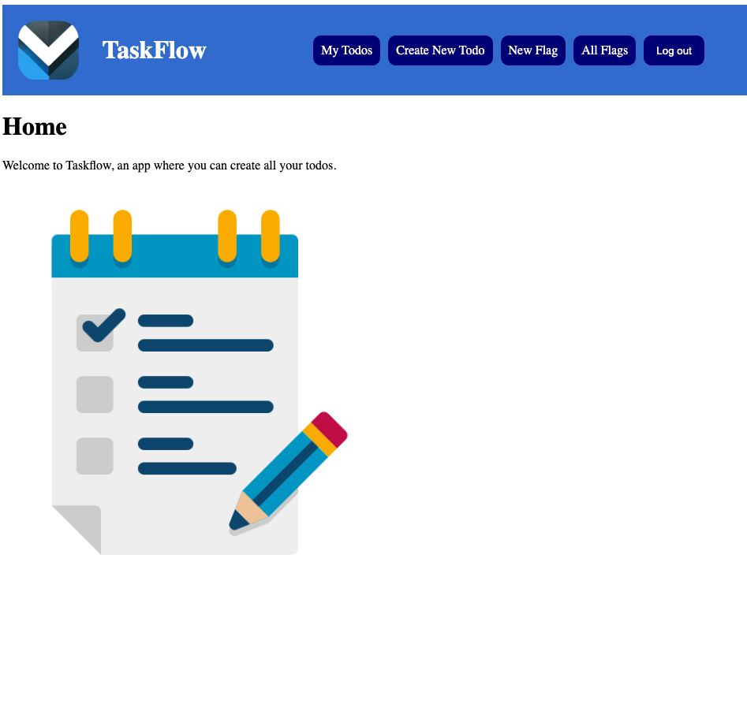

# TaskFlow

## Description
This app is a to-do list that allows signed-in users to perform full CRUD on a todo. The app also allows the user to create flags to apply to a todo. The user can filter each of the to-do's based on if they want the completed items to be shown, or if they want to view todos based on the flags assigned to them. 

## Getting Started
[Deployed Link](https://shrouded-basin-96663-500cacf6cd48.herokuapp.com/)

[Github Link](https://github.com/ckremer99/django-taskflow-app.git)

[Project Planning](https://trello.com/invite/b/66cf74a4419a4df51a6915b1/ATTIb84b569ecf3f7795b58333418ee9582e7643288A/taskflow)

## Technologies Used
- HTML
- CSS
- Python
- Django
- Javascript

## Stretch Goals
I good stretch goal would be to allow the items to be sorted based on criteria specified by the user. 
